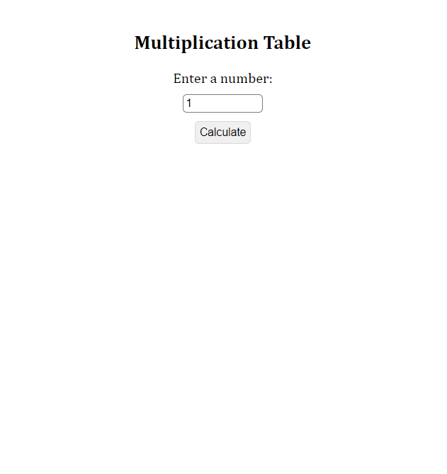

# Multiplication Table

In that project, it was used: HTML5, CSS3, and Javascript.

A simple project that gets a number on input and returns all multiplications of it.

It was training mostly to Javascript and DOM manipulation explored on the console and passed to script.

## Preview Picture

### See in action

If you want to see how it works, I recommend to [fork](https://docs.github.com/en/get-started/quickstart/fork-a-repo) this repo and opening it in an IDE or in a Source-code editor.

## Used stacks

, , ,  and 

## Author

Hugo Teixeira - 8Dev - Djbetamax

### Contact links

 -  - 
